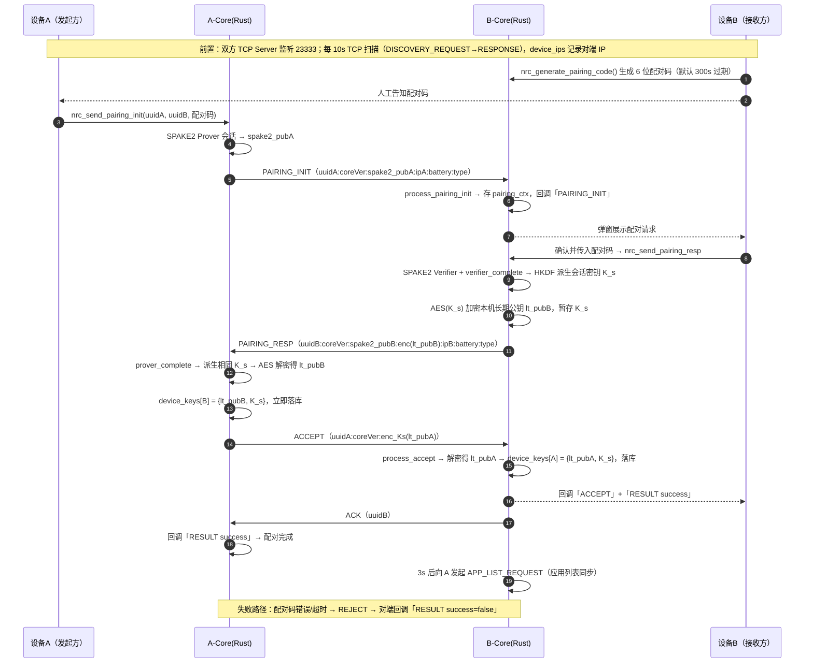
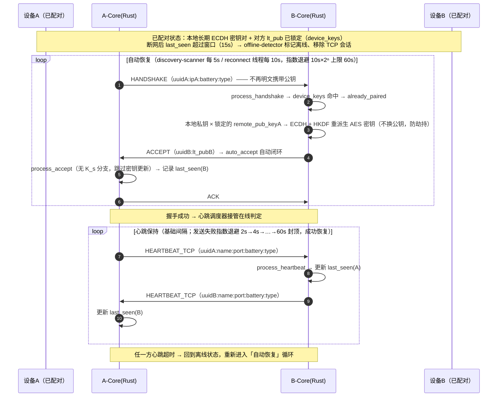

# 配对与重连时序（core / Rust）

> 依据 notify-relay-core 实际代码绘制，覆盖：首次配对（SPAKE2 配对码认证）与已配对设备恢复连接（自动握手 + 心跳）。
> 协议层：TCP 二进制帧（端口 23333），短连接模型，在线判定以 `heartbeat.last_seen` 15s 窗口为准。

## 零、core 版本兼容（0.2.0 起）

版本号（`CARGO_PKG_VERSION`，语义化 `major.minor.patch`）参与全链路校验，**仅比较 `major.minor`**，
patch 差异仍互通（便于补丁级修复）：

| 通道 | 明文携带位置 | 校验点 |
|---|---|---|
| PAIRING_INIT | 第 2 段 `uuid:coreVersion:spake2_pub:ip:battery:device_type` | `process_pairing_init` |
| PAIRING_RESP | 第 2 段 `uuid:coreVersion:spake2_pub:enc_lt_pub:ip:battery:device_type` | `process_pairing_resp` |
| ACCEPT | 第 2 段 `uuid:coreVersion:enc_lt_pub` | `process_accept` |
| HANDSHAKE | JSON 字段 `coreVersion` | `process_handshake` |
| DATA_* | 第 3 段 `DATA_TYPE:uuid:coreVersion:pub_key:encrypted_data` | `process_data` |

除明文校验外，DATA 通道的 AES-GCM 密文以 **AAD = `NotifyRelay-Data-v{major}.{minor}`** 绑定同一版本
（`crypto::aes::encrypt_with_aad` / `decrypt_with_aad`）：**即便双方公钥与密钥完全一致，跨 `major.minor`
也无法解密**，从密码学层面阻断跨版本通信。明文与密文双重约束，任一被绕过仍无法互通。

不兼容时的行为：握手/配对帧直接返回 `-1` 并记录 warn 日志（不建立半可用连接），DATA 帧在解密前丢弃。
两端升级到同一 `major.minor` 后自动恢复互通，无需重新配对（长期密钥未变）。

## 零之二、实时状态时间戳（消除断线积压"追逐"）

断线期间发送队列会持续累积实时状态（超级岛 / 媒体），恢复后按序回放会造成歌词/进度"追逐"。
core 在实时状态 wire 中注入生成时刻 `ts`（毫秒 Unix 时间戳，`timestamp` 模块）：

- **发送端**：`SenderQueue::enqueue` 统一为实时 header（`DATA_SUPERISLAND` / `DATA_MEDIAPLAY`）补齐 `ts`；
  `state_merge::push_state` 入队前调用 `purge_stale_realtime` 丢弃超过 `STATE_MAX_AGE_MS`(15s) 的积压，
  并强制本次推送为 FULL（丢弃 DELTA 可能使接收端基线缺字段，FULL 可一次性重建）。
- **接收端**：`merge_incoming` 丢弃超过 15s 的过期包，以及 `ts` 小于该会话 `last_ts` 的乱序旧包，
  返回 `MergeOutcome::Dropped`（视为已消费，不再下发平台）。
- **结束包**（`terminateValue == "__END__"`）不参与丢弃：会话终止信号必须送达，否则对端卡片/岛残留。
- **通知**（`DATA_NOTIFICATION`）只注入并记录 `ts`，**不做丢弃**：断线期间的通知累积是有益的，恢复后应完整补收。

`STATE_MAX_AGE_MS` 取值 15s 的约束：必须大于发送端保活间隔（超级岛 8s / 媒体 6s）与接收端卡片超时周期
（PC 普通岛 12s / Gamebar 10s），否则正常保活包会被误判过期导致卡片"突然消失"。

**时钟假设**：`ts` 由发送端本地时钟生成，接收端用本地时钟判定过期与乱序，因此要求两端时钟大致同步
（同一局域网内的手机/PC 通常由 NTP 对齐，偏差远小于 15s 窗口）。若两端时钟偏差超过窗口，
实时状态会被整体误丢；此时 `ts <= 0`（未携带）的保守分支不生效，因为新版本一定携带 `ts`。
这是以「宁可丢弃过期歌词/进度，也不回放造成追逐」为目标的取舍——实时状态丢失可由下一次推送
（含保活，间隔 ≤8s）自然恢复，而错误回放的观感损失不可逆。

## 一、两台设备首次配对

## 二、已配对设备恢复连接

## 关键机制

- **配对安全**：配对码仅参与 SPAKE2 口令协商，两端独立派生对称会话密钥 K_s（HKDF）；长期公钥 lt_pub 全程以 K_s 加密传输，配对成功后 K_s 清零，仅保留 ECDH 长期密钥。
- **重连身份锁定**：重连 HANDSHAKE 不携带公钥，以配对阶段锁定的 remote_pub_key 重派生 AES 密钥，中间人无法替换公钥。
- **在线判定**：不依赖 TCP 会话，以 heartbeat.last_seen 15s 窗口为准；重连线程、发现扫描、心跳三套机制共用同一判据，避免无限重复握手。

## 参考文件

| 文件 | 关键内容 |
|---|---|
| `src/ffi/send.rs` | `nrc_send_pairing_init`（发起方完整配对流程）、`nrc_send_pairing_resp`（接收方回复）、`nrc_generate_pairing_code`/`nrc_clear_pairing_code`（配对码）、`nrc_connect_device`（主动握手重连）、`nrc_periodic_broadcast`（TCP 扫描发现） |
| `src/ffi/processing.rs` | `process_pairing_init` / `process_pairing_resp` / `process_accept` / `process_reject` / `process_handshake`（已配对自动 ACCEPT）/ `process_heartbeat` |
| `src/crypto/spake2.rs` | SPAKE2 Prover/Verifier 会话生成与完成 |
| `src/crypto/hkdf.rs` | 会话密钥 K_s 派生 |
| `src/crypto/aes.rs` | lt_pub 加解密 |
| `src/crypto/ecdh.rs` | 长期密钥对生成与共享密钥计算 |
| `src/reconnect.rs` | 重连线程：指数退避 10s×2ⁿ（上限 60s）、在线判定、HANDSHAKE 重试 |
| `src/discovery/mod.rs` | known_device_scanner：离线设备自动握手（5s/15s 周期） |
| `src/heartbeat/mod.rs` | 心跳发送与退避（2s→60s）、`offline-detector`、`heartbeat-scheduler` |
| `src/network/mod.rs` | TCP 服务器（handle_connection）、oneshot 收发、TCP 扫描发现 |
| `src/protocol/codec.rs` | 帧编码：PAIRING_INIT/RESP、ACCEPT、HANDSHAKE、HEARTBEAT_TCP、DISCOVERY |
| `src/protocol/header.rs` | 消息类型常量（MessageType）与功能标志（FeatureFlag） |
